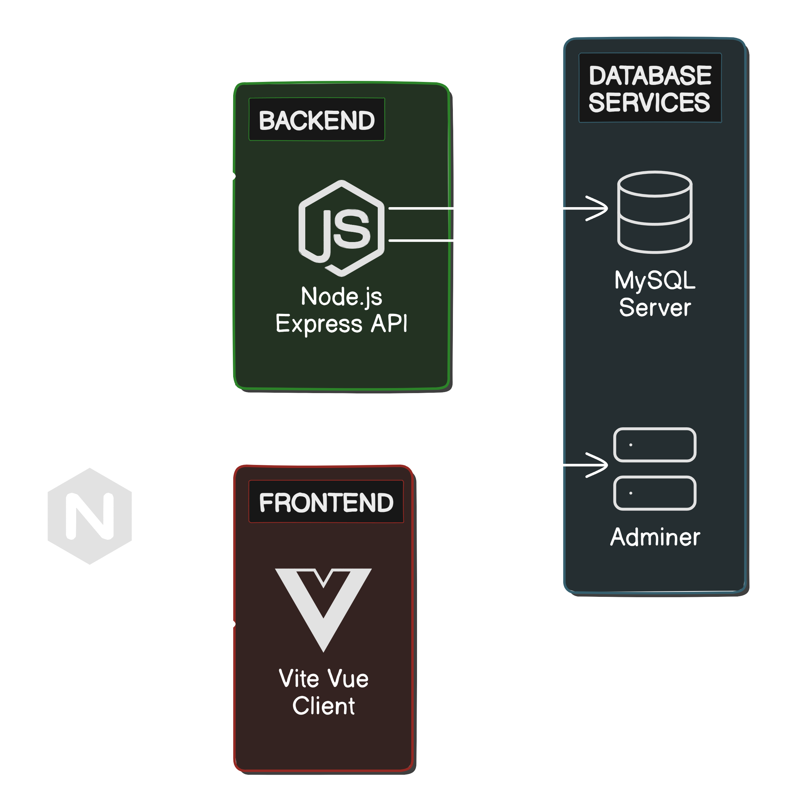

# CO2-Runter Website Documentation

Welcome to the CO2-Runter Website source repository! This README aims to provide a detailed introduction to this project, explaining its technical architecture, front-end design, back-end APIs, and how these elements are bound together by the utilized tech stack.

## Table of Contents

- [Tech Stack](#tech-stack)
- [Frontend Details](#frontend)
- [API](#api)
- [Database](#database)
- [License](#license)
- [Contributing](#contributing)
- [License](#license)

## Tech Stack

The tech stack employed in this repository includes:

- [Vue.js](https://vuejs.org/)
- [Node.js](https://nodejs.org/en/)
- [Docker](https://www.docker.com/)
- [MySQL](https://www.mysql.com/)
- [Nginx](https://www.nginx.com/)

These technologies contribute to the project's architecture, allowing the components to interact as visualized in the following diagram: 

The project utilizes Docker containers for each component, making deployment lightweight and manageable.

## Frontend

This project is a modernized redevelopment of the Co2 Runter Website project leveraging the latest frontend technologies.

### Technologies

This project utilizes the following technologies:

- Vue 3: Progressive JavaScript framework for building user interfaces.
- Vuetify: A Material Design component framework for Vue.js.
- Pinia: State management for Vue.

Refer to the [Frontend README](./frontend/README.md) for detailed information on frontend implementation.

## API

This project consists of several APIs to facilitate various functionalities such as user authentication, dashboard management, footprint calculation, group interactions, user management, and more. Each API endpoint is documented thoroughly in separate markdown files, which includes details on HTTP methods, request parameters, request bodies, and responses. Find the API details in the markdown files listed below:

- [Authentication API](./API/Authentication.md)
- [Dashboard API](./API/Dashboard.md)
- [Footprint and Questions Districts API](./API/Footprint_Questions_Districts.md)
- [Group API](./API/Group.md)
- [Template API](./API/Template.md)
- [User API](./API/User.md)

## Database

The project uses MySQL as the primary database, and it's included in the Docker compose file. The required tables 
are generated with the "setup.sql" script. Navigate to the [Database README](./Database/README.md) for detailed 
instructions on configuring the database and understanding the data structure.

## Contributing

Contributing to CO2 Runter Web Application is easy:

1. **Create a New Branch**: Start a new branch for your feature, bug fix, or documentation update.
2. **Make Commits**: Make descriptive commits on your branch.
3. **Push Your Branch**: Push your branch to the remote repository.
4. **Create a Pull Request (PR)**: Create a PR on GitHub from your branch.
5. **Review and Merge**: Your PR will be reviewed and merged into the main repository.

## License

This project is licensed under the Creative Commons CC0 1.0 Universal License. For more details, see
the [LICENSE](https://github.com/stadt-karlsruhe/CO2-Runter?tab=CC0-1.0-1-ov-file) file.

