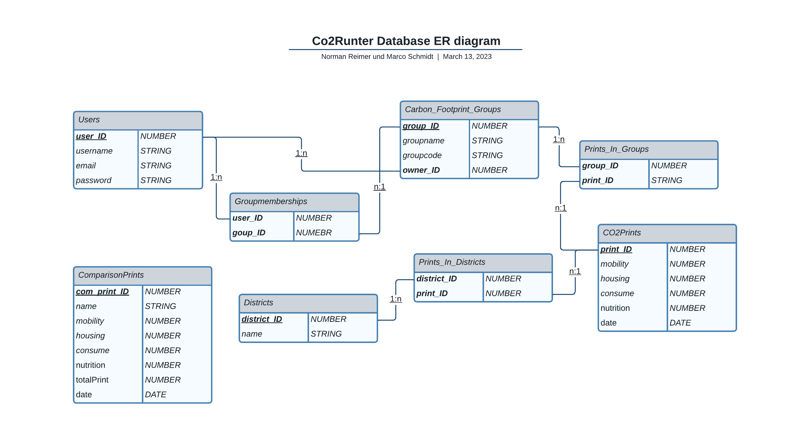

**Database**
----
The used database is a MySQL database. It is inclouded in docker compose and the needed tables will be generated with then "setup.sql" skript.

* **Structure**

    The structure of the database is as follows:
    

* **Tables**

  Most tables are self-explanatory, only the ComparisonPrint requires an explanation:

  * **ComparisonPrint** This table stores the data of pre-calculated carbon footprints, such as the average carbon footprint in Karlsruhe in 2019 or the required footprint in 2030 to comply with the Paris Agreement. This data is used to plot them against the submitted footprints.